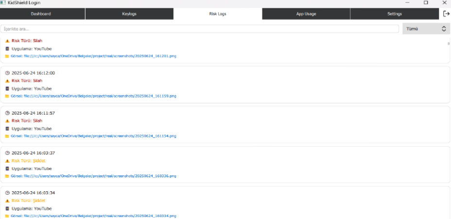

# Parental-Control
# 👨‍👩‍👧‍👦 Parental Control System

A **real-time parental control and content filtering system** built with Python, PyQt5, and machine learning models.  
The system monitors children’s computer usage and automatically detects **weapons, violent scenes, and toxic text content** using deep learning techniques.  


---

## 🎯 Project Objectives

- Monitor children’s digital activities in real time.  
- Detect harmful content in **images, videos, and text**.  
- Provide parents with **detailed logs, risk scores, and app usage statistics**.  
- Enable parents to set **time limits** and receive notifications when limits are exceeded.  
- Build a modular, extensible desktop application with a **modern dashboard**.  

---

## 🧱 System Architecture

The project consists of three main layers:  

1. **Monitoring Layer**  
   - Captures screenshots (`capture_screen()`) at fixed intervals.  
   - Detects the currently active application (`get_active_window_process_name()`).  
   - Categorizes applications into groups: **Games, Web, Social, Video, Education, System**.  

2. **Analysis Layer**  
   - **YOLOv8 (Ultralytics)** → Detects weapons from screenshots.  
   - **3D CNN (VGG16 + LSTM hybrid)** → Detects violence in video segments (64 frames).  
   - **OCR (EasyOCR)** → Extracts on-screen text in Turkish.  
   - **BERT (HuggingFace Transformers)** → Classifies extracted text as toxic or safe.  
   - **Risk Scoring**: Each detection adds weighted risk points (e.g., weapon = 60, violence = 40, profanity = 30).  

3. **Storage & Visualization Layer**  
   - **SQLite3 database (`parental_control.db`)** stores all logs:  
     - `risk_log`: risk events with timestamp, app name, image path, and scores.  
     - `app_usage`: app start/stop times and total durations.  
   - **JSON (`limits.json`)** stores configurable time limits per category.  
   - **PyQt5 + QML GUI** presents data in a dashboard with charts, KPI cards, and logs.  

---

## 🚀 Features

### 🔍 Content Analysis
- **Weapons** → YOLOv8 object detection model trained on Roboflow dataset.  
- **Violence** → 3D CNN trained on 10 epochs with violence/non-violence datasets.  
- **Toxic Text** → OCR + BERT (Turkish `dbmdz/bert-base-turkish-cased`).  

### ⏱️ Screen Time Tracking
- Logs total daily usage.  
- Computes duration from the difference between first and last app logs.  

### 📂 Keylogging
- Stores keystrokes in daily `.txt` files (`dd-mm-yyyy.txt`).  
- Integrated into GUI via `QAbstractListModel`.  

### 🌐 Web History Tracking
- Fetches history from Chrome/Edge databases.  
- Applies risk analysis on visited site titles.  

### ⚙️ Settings Panel
- Category-based time limits (e.g., Games → 2h/day).  
- Email address configuration for alerts.  
- Start/Stop monitoring button.  
- Auto-start monitoring with Windows Registry integration.  

### 📊 Dashboard (PyQt5 + QML)
- **KPI Cards**: total risks, screen time, most used app.  
- **Risk Distribution Chart**: Pie/Line chart visualization.  
- **Risk Image Gallery**: blurred risky screenshots.  
- **Logs**: searchable and filterable risk/event logs.  

---

## 🛠️ Technologies & Tools

- **Programming Language:** Python 3.10  
- **GUI Framework:** PyQt5 + QML (modern, modular UI)  
- **Computer Vision:** YOLOv8 (Ultralytics), OpenCV  
- **Deep Learning:** TensorFlow, Keras (3D CNN for violence detection)  
- **NLP:** HuggingFace Transformers (BERT), EasyOCR  
- **Database:** SQLite3  
- **Configuration:** JSON  
- **Parallel Processing:** ThreadPoolExecutor (for real-time inference)  

---

## 📂 Database Schema

**Database:** `parental_control.db`  

### 🔹 Table: `risk_log`
| Column           | Type    | Description                          |
|------------------|---------|--------------------------------------|
| id               | INT     | Primary Key                          |
| timestamp        | TEXT    | Event timestamp                      |
| image_path       | TEXT    | Path to screenshot                   |
| app_name         | TEXT    | Application name                     |
| context          | TEXT    | Category (game, web, etc.)           |
| risk_score       | INT     | Total risk score                     |
| weapon_detected  | INT     | 1 if weapon detected                 |
| violence_detected| INT     | 1 if violence detected               |
| toxic_detected   | INT     | 1 if toxic text detected             |

### 🔹 Table: `app_usage`
| Column     | Type    | Description                  |
|------------|---------|------------------------------|
| id         | INT     | Primary Key                  |
| app_name   | TEXT    | Application name             |
| context    | TEXT    | Category                     |
| start_time | TEXT    | Session start timestamp      |
| end_time   | TEXT    | Session end timestamp        |
| duration   | INT     | Duration in seconds          |

---

## ⚡ Installation & Setup

### 1️⃣ Clone the repository
```bash
git clone https://github.com/username/parental-control-system.git
cd parental-control-system
```
### 2️⃣ Create virtual environment & install dependencies
```bash
python -m venv venv
source venv/bin/activate   # Linux/Mac
venv\Scripts\activate      # Windows

pip install -r requirements.txt
```
### 3️⃣ Initialize database
```bash
python init_db.py
```
### 4️⃣ Run the application
```bash
python app.py
```
---
### Usage Workflow
1. Launch → Login Screen (register or sign in). 
2. Navigate to Dashboard.
3. System runs in background, monitoring continuously.
4. Risky content gets logged into database + displayed in GUI. 


# Parent can:


- View logs and screenshots. 
- Track app usage and screen time.
- Configure time limits.
- Receive alerts via notifications/email. 


---
### Model Performance
- YOLOv8 (Weapon detection): mAP > 85%
- 3D CNN (Violence detection): Accuracy ~ 82%
- BERT (Toxic text classification): F1 score ~ 80%
  Performance tested on custom datasets with GPU acceleration. 
---
### Security & Privacy
- All monitoring data is stored locally (no cloud). 
- Parents’ email is stored securely in limits.json.
- Only active application windows are analyzed to reduce overhead.
- Thread-based parallel execution prevents UI freezing.
---
### 📸 Screenshots (Examples)



